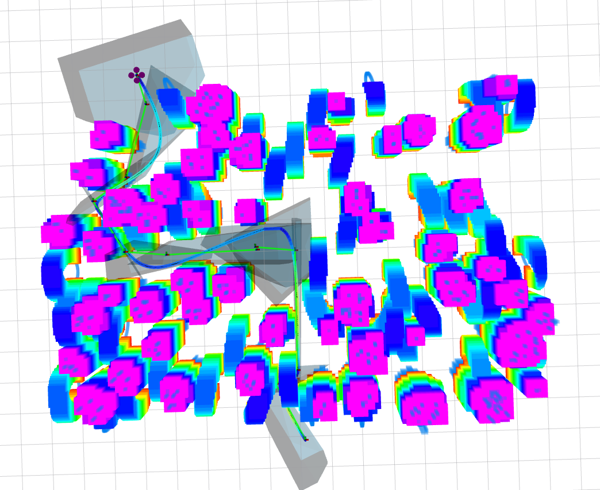
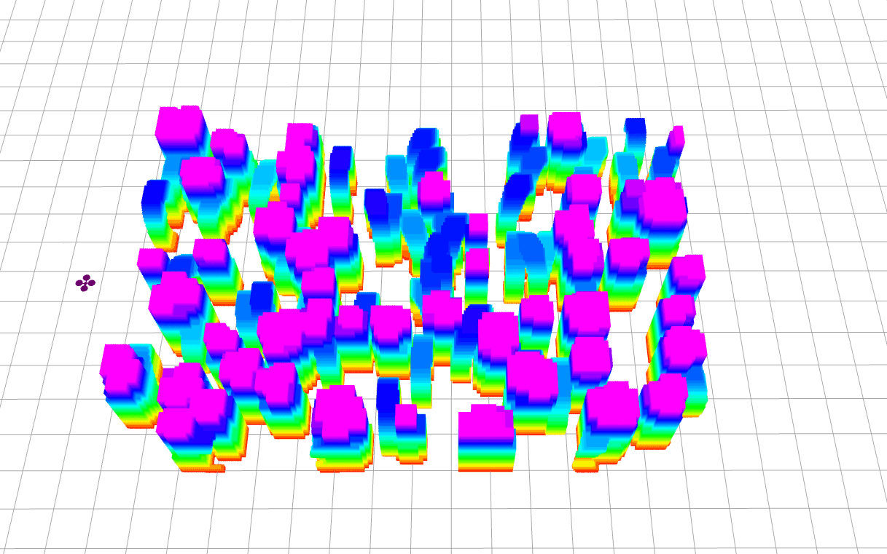
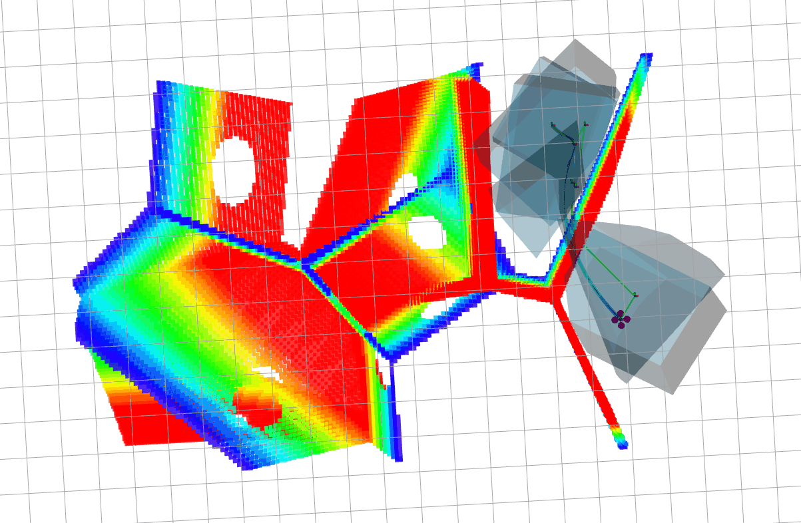

<!-- PROJECT SHIELDS -->
<!--
*** I'm using markdown "reference style" links for readability.
*** Reference links are enclosed in brackets [ ] instead of parentheses ( ).
*** See the bottom of this document for the declaration of the reference variables
*** for contributors-url, forks-url, etc. This is an optional, concise syntax you may use.
*** https://www.markdownguide.org/basic-syntax/#reference-style-links
-->
[![Contributors][contributors-shield]][contributors-url]
[![Forks][forks-shield]][forks-url]
[![Stargazers][stars-shield]][stars-url]
[![Issues][issues-shield]][issues-url]
[![MIT License][license-shield]][license-url]


# An implementation of k-PRM path planner with corridor-based trajectory optimization

This is course project of Group 17 for RO47005 Planning and Decision Making in TU Delft. We implemented k-PRM for front-end path searching and an iterative method for back-end corridor-based trajectory optimization.



## 1. Our contribution

- We implement occupancy map generation from scratch (please check `src/planner/map_server/`).
- We implement PRM planner and k-d tree from scratch .
- We implement A-star method for graph search from scratch (please check `src/planner/prm_planner/`).
- We implement classic minimum-snap trajectory optimization (both optimization solution and closed-form solution) from scratch (please check `src/planner/traj_opt/`).
- We implement corridor-based trajectory optimization from scratch (please check `src/planner/traj_opt/`). We use [OSQP_Interface](https://github.com/ZJU-FAST-Lab/OSQP_Interface) to solve QP problem. We also use [Root-Finder](https://github.com/ZJU-FAST-Lab/Root-Finder) to find tangent point of polynomial trajectory.
- The simulation environment (including simulator and controller) we used is cloned from [Fast-Planner](https://github.com/HKUST-Aerial-Robotics/Fast-Planner) 
- We use [DecompROS](https://github.com/sikang/DecompROS) for safe flight corridor generation directly from occupancy map.
- We use [mockamap](https://github.com/HKUST-Aerial-Robotics/mockamap) with tiny modification to randomly generate point clouds and publish only once.
- We compared our PRM planner with [RRTs](https://github.com/medalotte/sampling-based-planners)

## 2. Build a demo

**Step 1**. Install Armadillo, which is required by `uav_simulator` package.

```
sudo apt-get install libarmadillo-dev
```

**Step 2**. Install [OSQP](https://github.com/osqp/osqp), which is required by `traj_opt` package.


**Step 3**. clone this repo

```
cd ~/<your_catkin_ws>/src
git clone https://github.com/edmundwsy/RO47005-PDM-Final.git
cd ..
```

**Step 4**. Build the project
```
catkin_make
```

## 3. Run a simple demo

Load configuration files

```
source devel/setup.bash
```

### 3.1 Demo in random forest environment

Run following command to launch our project in rviz

```
roslaunch planner simulation.launch
```

Use 2D Nav Goal in rviz to publish a goal point



### 3.2 Demo in 3D Maze environment

Run following command to launch our project in rviz

```
roslaunch planner maze3d.launch
```




### 3.3 Compare with RRT

Run following command to launch rrt_planner
```
roslaunch rrt_planner simulation_with_map.launch

```


## Structure

```
├── ./planner
│   ├── ./planner/prm_planner   <our implementation>
│   ├── ./planner/map_server    <our implementation>
│   ├── ./planner/rrt_planner
│   ├── ./planner/traj_opt      <our implementation>
│   └── ./planner/Utils
└── ./uav_simulator
    ├── ./uav_simulator/fake_drone
    ├── ./uav_simulator/local_sensing
    ├── ./uav_simulator/map_generator
    ├── ./uav_simulator/mockamap
    ├── ./uav_simulator/so3_control
    ├── ./uav_simulator/so3_quadrotor_simulator
    └── ./uav_simulator/Utils
```

## License

Distributed under the MIT License. See `LICENSE` for more information.

<!-- CONTACT -->
## Contact

Siyuan Wu - S.Wu-14@student.tudelft.nl
Moji Shi - M.Shi-5@student.tudelft.nl
Ranbao Deng - R.Deng@student.tudelft.nl
Liangchen Sui - L.Sui@student.tudelft.nl

<!-- MARKDOWN LINKS & IMAGES -->
<!-- https://www.markdownguide.org/basic-syntax/#reference-style-links -->
[contributors-shield]: https://img.shields.io/github/contributors/edmundwsy/RO47005-PDM-Final?style=for-the-badge
[contributors-url]: https://github.com/edmundwsy/RO47005-PDM-Final/graphs/contributors
[forks-shield]: https://img.shields.io/github/forks/edmundwsy/RO47005-PDM-Final?style=for-the-badge
[forks-url]: https://github.com/edmundwsy/RO47005-PDM-Final/network/members
[stars-shield]: https://img.shields.io/github/stars/edmundwsy/RO47005-PDM-Final?style=for-the-badge
[stars-url]: https://github.com/edmundwsy/RO47005-PDM-Final/stargazers
[issues-shield]: https://img.shields.io/github/issues/edmundwsy/RO47005-PDM-Final?style=for-the-badge
[issues-url]: https://github.com/edmundwsy/RO47005-PDM-Final/issues
[license-shield]: https://img.shields.io/github/license/edmundwsy/RO47005-PDM-Final?style=for-the-badge
[license-url]: https://github.com/edmundwsy/RO47005-PDM-Final/blob/master/LICENSE
[product-screenshot]: images/00.png
